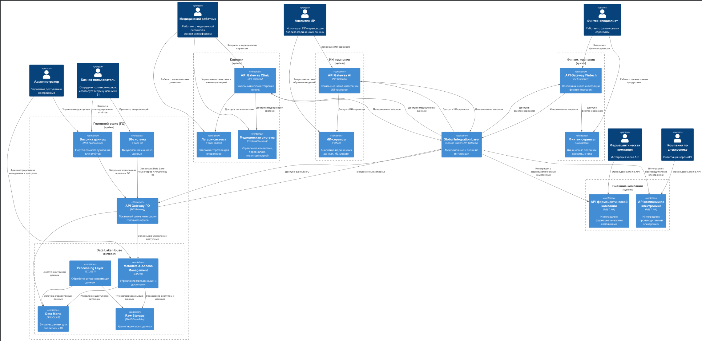

## Архитектура системы через год (Диаграмма контейнеров C4)

На основе предоставленных данных и требований, вот предлагаемая архитектура на перспективу одного года. Ключевые принципы: разделение доменов, отказ от монолитного DWH в пользу распределённой Data Mesh архитектуры, создание единого портала-витрины для самообслуживания.

## Выявление и приоритизация проблемных мест

Для приоритизации используется метод **MoSCoW**. Это понятный бизнесу метод, который классифицирует задачи по категориям: Must have (должны быть решены), Should have (следует решить), Could have (могли бы решить) и Won't have (не будут решены в этой фазе).

| Приоритет           | Проблемное место                                      | Описание (для IT и бизнеса)                                                                                                                                                                                                                                   |
| :------------------ | :---------------------------------------------------- | :------------------------------------------------------------------------------------------------------------------------------------------------------------------------------------------------------------------------------------------------------------ |
| **M** (Must have)   | **Устаревший монолитный DWH**                         | Текущее хранилище данных (MS SQL Server 2008) является "бутылочным горлышком" всей системы. Оно не справляется с объемом данных и сложностью запросов, что приводит к часам ожидания отчетов. Его архитектура препятствует быстрой интеграции новых бизнесов. |
| **M** (Must have)   | **Смешение ответственности**                          | В текущем DWH смешаны данные из разных доменов (медицина, финансы, операции). Это создает хаотичные зависимости, усложняет развитие и нарушает принципы безопасности данных (доступ к финансовым данным имеют те, кому нужны только медицинские).             |
| **M** (Must have)   | **Отсутствие единого каталога и управления доступом** | Сотрудникам сложно найти нужные данные для отчетов, а ИТ-отделу — контролировать, кто и к каким данным имеет доступ. Это создает риски безопасности и неэффективность работы аналитиков.                                                                      |
| **S** (Should have) | **Неэффективные процессы трансформации данных**       | ETL-процессы завязаны на возможности одного DWH. Любое изменение требует сложных преобразований внутри него, что замедляет вывод новых отчетов (time-to-market) и снижает общую производительность системы.                                                   |
| **S** (Should have) | **Риски безопасности и согласованности**              | Совместное хранение чувствительных медицинских и финансовых данных в одной системе без четкого разграничения доступа создает огромные риски нарушения законодательства (например, 152-ФЗ о персональных данных, банковские нормы).                            |
| **S** (Should have) | **Слабая масштабируемость**                           | Текущая архитектура вертикально масштабируема (нужно покупать более мощный сервер). Это дорого и имеет физический предел. Горизонтальная масштабируемость (добавление новых серверов) практически невозможна.                                                 |
| **C** (Could have)  | **Наличие легаси технологий (Power Builder)**         | Устаревшая клиентская технология усложняет поиск разработчиков и интеграцию с современными веб-сервисами. Однако ее замена не является критичной для решения первоочередных задач с данными.                                                                  |
| **C** (Could have)  | **Разрозненность стека технологий**                   | Использование разных языков (Python, Go, Java) и шины (Apache Camel) может увеличивать операционные издержки на поддержку. Но на данном этапе это менее критично, чем фундаментальные проблемы с данными.                                                     |
| **W** (Won't have)  | **Полный отказ от всех легаси-систем**                | В течение года мы не ставим цель полностью избавиться от всего старого (например, того же Power Builder). Мы изолируем их, наладив работу с новыми сервисами, а их полная замена является задачей на более длительный срок.                                   |
