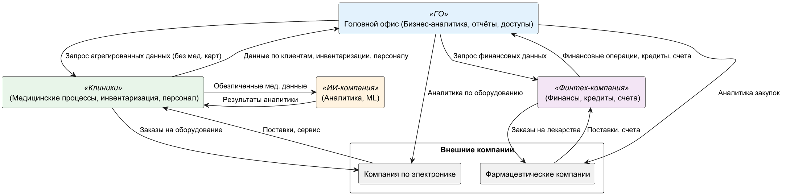

# Логика разделения на домены

## Принципы разделения

1. **Бизнес-автономность**  
   Каждый домен соответствует отдельному бизнес-направлению компании, что позволяет развивать сервисы независимо друг от друга.

2. **Технологическая независимость**  
   В каждом домене используются свои технологии, API и бизнес-логика, что упрощает внедрение новых функциональностей и интеграцию.

3. **Изоляция данных**  
   Данные, не требующие сквозной аналитики (например, медицинские карты), остаются внутри соответствующего домена и не передаются в другие.

4. **Стандартизированные интеграции**  
   Взаимодействие между доменами и с внешними компаниями реализуется через интеграционный слой и стандартизированные API, что позволит снизить затраты на поддержку.

## Описание доменов

| Домен            | Описание и ответственность                                                    |
| ---------------- | ----------------------------------------------------------------------------- |
| Головной офис    | Бизнес-аналитика, отчёты, управление доступами, агрегирование данных          |
| Клиники          | Медицинские процессы, управление персоналом, работа с клиентскими данные      |
| ИИ-компания      | Аналитика медицинских данных, ML-модели, обезличенные данные                  |
| Финтех-компания  | Финансовые операции, кредиты, счета, интеграция с банком                      |
| Внешние компании | Фармацевтические компании и компания по мед. электроние, интеграция через API |

## Data Flow Diagram

## Преимущества, которые можно подчеркнуть

- **Независимое развитие доменов** — новые функции и сервисы внедряются без изменений в других доменах.
- **Ускорение time-to-market** - новые функции и отчеты можно разрабатывать быстрее, так как не нужно модифицировать сложный монолит.
- **Упрощение интеграций** — стандартизированные API позволяют быстро подключать новых партнёров и сервисы.
- **Снижение нагрузки на DWH** — бизнес-логика и обработка данных вынесены в домены, DWH используется только для хранения и агрегации.
- **Гибкость и масштабируемость** — легко добавлять новые бизнесы и направления.
- **Повышение безопасности** — доступ к данным и сервисам контролируется на уровне домена.
