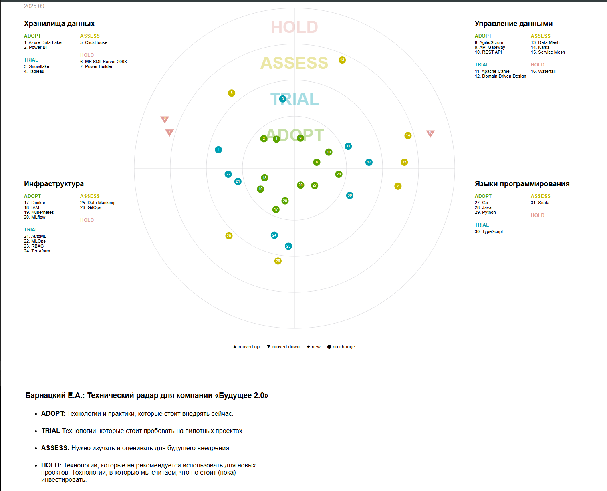
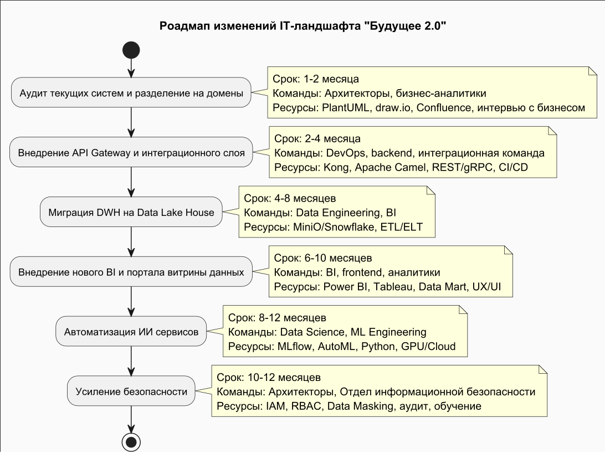

# Технический радар

| Категория     | Используется сейчас               | Рекомендуется внедрить/развивать      | На перспективу/исследовать        |
| ------------- | --------------------------------- | ------------------------------------- | --------------------------------- |
| DWH/Хранилище | MS SQL Server 2008, Power Builder | Data Lake House (MiniO, Snowflake)    | Lakehouse, Delta Lake, Iceberg    |
| BI            | Power BI                          | Self-service BI, Data Mart, Tableau   | ML-аналитика, Augmented Analytics |
| Интеграции    | Apache Camel                      | API Gateway, Event-driven, REST/gRPC  | Kafka, Service Mesh, Async API    |
| Финтех        | Golang, Java                      | Микросервисы, OpenAPI, CI/CD          | Blockchain, Open Banking          |
| ИИ            | Python                            | MLflow, AutoML, MLOps                 | LLM, Federated Learning           |
| DevOps        | Неизвестно                        | Docker, Kubernetes, IaC, GitLab CI/CD | GitOps, Serverless                |
| Безопасность  | Неизвестно                        | IAM, RBAC, Data Masking               | Zero Trust, DLP                   |
| Методологии   | Waterfall, ручные процессы        | Agile, Scrum, Domain Driven Design    | Data Mesh, Product Teams          |

---

# Zalando Tech Radar

Можно запустить на локалхосте

### 1. cd tech-radar-master

### 2. npm install

### 3. npm start

## 

# Роадмап изменений (пример в виде таблицы)

# Обоснование этапов роадмапа:

### 1. Аудит текущих систем и разделение на домены

Позволяет выявить слабые места, определить границы ответственности, снизить зависимость между бизнес-направлениями. Это основа для независимого развития и масштабирования каждого домена.

### 2. Внедрение API Gateway и интеграционного слоя

Стандартизирует обмен данными между доменами и внешними компаниями, упрощает интеграцию новых сервисов, снижает затраты на поддержку и повышает безопасность.

### 3. Миграция DWH на Data Lake House

Обеспечивает гибкость хранения и обработки больших объёмов данных, ускоряет построение отчётов, снижает нагрузку на легаси-системы, открывает возможности для новых аналитических сервисов.

### 4. Внедрение нового BI и портала витрины данных

Дает бизнесу инструменты для самостоятельной аналитики, ускоряет принятие решений, снижает нагрузку на IT и BI-команды, повышает прозрачность данных.

### 5. Автоматизация ИИ-сервисов

Упрощает и ускоряет внедрение моделей машинного обучения, повышает качество аналитики, снижает ручной труд и риски ошибок, обеспечивает воспроизводимость и контроль.

### 6. Усиление безопасности и IAM

Защищает данные компании, обеспечивает соответствие требованиям регуляторов, снижает риски утечек и несанкционированного доступа, централизует управление доступами.

---
